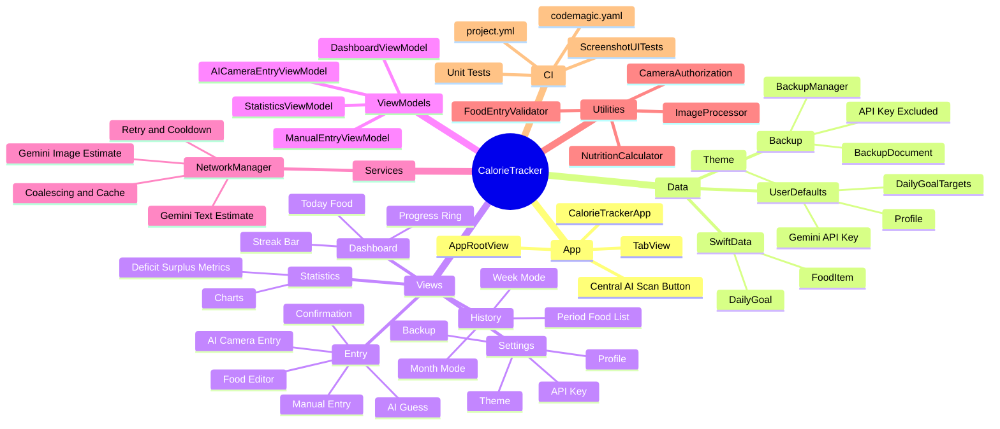

# Architecture

## Shape
The app is a SwiftUI MVVM app backed by SwiftData. Views own presentation, ViewModels own screen state and operations, models define persisted data, utilities hold reusable pure-ish helpers, and services perform external API calls.

## Data Flow
1. User acts in SwiftUI view.
2. View calls a ViewModel or local save closure.
3. ViewModel validates with `FoodEntryValidator` where needed.
4. SwiftData `ModelContext` inserts/updates/deletes `DailyGoal` and `FoodItem`.
5. Goal totals are recalculated before save.
6. Views reload through ViewModel state, SwiftData fetches, or `foodItemsDidChange` notification.

## AI Flow
Image AI:
`AICameraEntryView` -> `AICameraEntryViewModel` -> `ImageProcessor` -> `NutritionEstimating` -> `NetworkManager` -> retry/gate/cache -> Gemini -> `NutritionEstimate` -> `FoodConfirmationView` -> SwiftData.

Text AI:
`ManualEntryView` AI Guess tab -> `ManualEntryViewModel` -> `NutritionEstimating` -> `NetworkManager` -> Gemini Flash-Lite -> editable fields -> SwiftData.

Gemini responses are constrained by JSON Schema and validated again locally. Temporary server failures receive bounded retry. Rate limits create a local cooldown, identical requests share one in-flight task, and successful estimates are cached briefly.

## Persistence
- `DailyGoal` and `FoodItem` are SwiftData `@Model` types.
- Current diet targets are stored in `UserDefaults` through `DailyGoalTargets`.
- Profile/settings/API key/theme/backup metadata use `@AppStorage` and backup snapshots.
- Backups serialize goals, food items, profile, settings, image data, and current targets.
- Backups are fully validated before replacing current SwiftData records and intentionally exclude the Gemini API key.
- `DailyGoalStore` canonicalizes one `DailyGoal` per calendar day without a SwiftData schema change.

## Mermaid Mindmap

## Future Agent Guidance
- Keep model changes conservative; add migration planning before changing persisted model shape.
- Prefer adding helper structs/functions near related views unless shared across screens.
- Keep AI responses parsed through `NutritionEstimate`.
- Keep external AI calls behind `NutritionEstimating` and cover new status handling with mocked `URLProtocol` tests.
- Preserve confirmation/edit-before-save behavior for AI outputs.
- Keep Codemagic workflows working from generated XcodeGen project.
